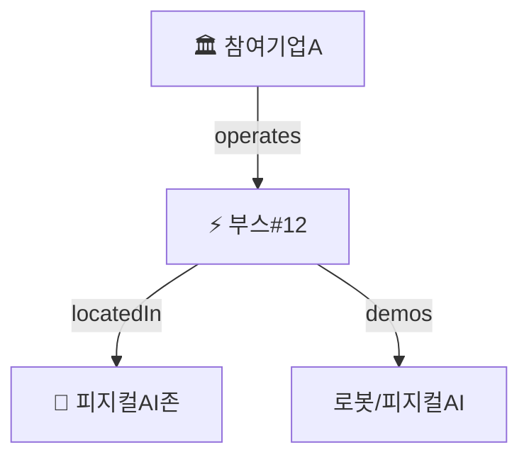

# M4. 지식그래프 — 살리기 + 시각화 + 진화

> **목표**: 지식그래프가 무엇인지 알고, kg.json을 그림(Mermaid)으로 옮긴다. **온토에어와의 연결점**을 잡는다.

## 한마디로

**지식그래프(Knowledge Graph)** = 트리플(점과 선)을 잔뜩 모아 만든 **거대한 관계 지도**.

::: tip 💡 쉽게 말하면 (친구 관계도처럼)
SNS에서 "내 친구의 친구" 같은 관계도를 본 적 있죠? 사람은 **동그라미(점)**, 친구 사이는 **선**으로 잇잖아요.
**지식그래프**도 똑같아요. 개체는 점, 관계는 선. 트리플을 수백 개 이으면 → 커다란 지도가 돼요.
- **온톨로지** = 규칙·틀 (설계도)
- **지식그래프(KG)** = 그 틀에 진짜 데이터를 채워 만든 지도
:::

## 핵심 개념

- **지식그래프(KG) = 온톨로지(틀) + 인스턴스(진짜 데이터)** 를 합쳐 실제로 굴러가게 한 것.
- **스키마 자동 진화**: 처음 보는 기업·기술이 들어와도 틀이 막히지 않고 **스스로 칸을 늘려가요**(open-world). onto-osint가 매일 이걸 해요.
  > **open-world(오픈 월드)** = "세상엔 아직 모르는 게 많다"고 보고, 새로운 게 나타나면 받아들이는 열린 태도. 반대는 "정해진 것 외엔 없다"고 보는 닫힌 방식.
- **스냅샷(snapshot)**: 하루치 지도를 `ontology/kg/YYYY-MM-DD.json` 파일로 **찰칵 저장**해 둬요. 그래서 어제와 오늘을 비교할 수 있어요 (예: `evt-027: D-1 → D-day`).
  > **snapshot(스냅샷)** = 그 순간을 사진 찍듯 저장한 것.

## onto-osint 대응

- `ontology/kg/2026-05-23.json` : 그날의 지식그래프 사진(스냅샷)
- 리포트의 Mermaid 그림 : 그 사진을 **사람 눈에 보기 좋게** 그린 것
- 변경 추적 부분 : 어제와 비교해 뭐가 바뀌었는지

## 온토에어 연결점 ★

**온토에어** = 온톨로지를 **시각화(눈에 보이게)** 해주는 도구예요. 즉 위에서 본 "Mermaid 그림"을 훨씬 멋지고 움직이게 만든 것이라고 보면 돼요.

→ 서초 페스타 지식그래프를 온토에어로 **인터랙티브하게(만지고 움직일 수 있게) 띄우면 = 10월 17일 전시 부스 콘텐츠**가 돼요. (나중에 들고 갈 수 있는 첫 결과물)

## 실습 ✏️

`kg/2026-05-23.json` 파일 하나를 열어서 **점 5개 + 선 5개**만 골라 Mermaid로 직접 그려봐요. (아래처럼 `graph TD`로 시작하면 위에서 아래로 그려져요.)

> 위 코드에서 `[ ]`는 동그라미(점)의 이름, `-->|글자|`는 화살표(선)에 붙는 관계 이름이에요.

## 완료 체크 ☐

- [ ] **KG = 온톨로지 + 인스턴스** 라는 걸 안다
- [ ] kg.json을 보고 **Mermaid 그림**으로 옮길 수 있다
- [ ] **온토에어**가 이 그림에서 무슨 역할인지 말할 수 있다
