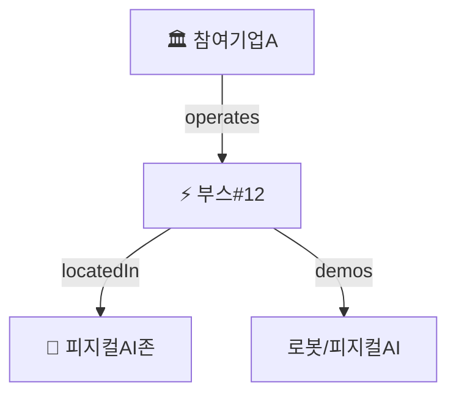

# M4. 지식그래프 — 살리기 + 시각화 + 진화

> **목표**: 지식그래프가 무엇인지 이해하고, kg.json 스냅샷을 Mermaid로 옮긴다. **온토에어와의 연결점**을 잡는다.

## 핵심 개념

- **지식그래프(KG) = 온톨로지(틀) + 인스턴스(실제 데이터)** 를 합쳐 실제로 돌아가게 한 것.
- **스키마 자동 진화**: 새 엔티티(처음 보는 기업/기술)가 들어오면 스키마가 닫혀있지 않고 **열린 채로 자라난다**(open-world). onto-osint가 매일 이걸 한다.
- **스냅샷**: 하루치 그래프를 `ontology/kg/YYYY-MM-DD.json`로 저장 → **시간에 따른 변화 추적**이 가능 (예: `evt-027: D-1 → D-day`).

## onto-osint 대응

- `ontology/kg/2026-05-23.json` : 그날의 지식그래프 스냅샷
- 리포트의 Mermaid : 그 스냅샷의 **사람용 시각화**
- 변경 추적 섹션 : 어제 대비 상태 전이

## 온토에어 연결점 ★

온토에어 = **온톨로지 시각화** 도구. 즉 M4의 "Mermaid 시각화"를 훨씬 강력하게 만든 것이 온토에어다.

→ 서초 페스타 KG를 온토에어로 **인터랙티브하게 띄우면 = 10/17 전시 부스 콘텐츠**가 된다. (온토에어 합류 때 들고 갈 첫 레퍼런스)

## 실습 ✏️

`kg/2026-05-23.json` 하나를 열어 **노드 5개 + 관계 5개를 손으로 골라** Mermaid로 직접 그려본다(`graph TD`). KG(JSON) → 그림으로 옮기는 감각을 만든다.

## 완료 체크 ☐

- [ ] KG = 온톨로지 + 인스턴스라는 걸 안다
- [ ] kg.json 스냅샷을 읽고 Mermaid로 옮길 수 있다
- [ ] 온토에어가 이 그림에서 무슨 역할인지 설명할 수 있다
