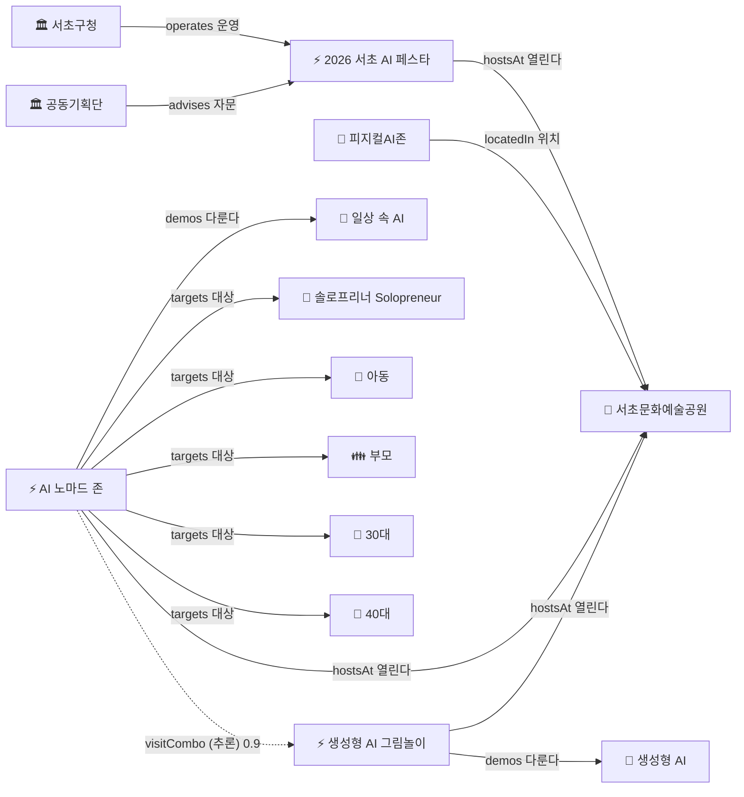

# 서초 AI 페스타 — 미니 온톨로지 (학습용)

onto-osint 레포와 **똑같은 3개 구조**를 손으로 작게 만들어보는 실습실이에요.

```
seocho-mini-ontology/
├── ontology/
│   ├── schema.json      ← ① 틀: 클래스(종류) + 관계        (M1·M2)
│   └── instances.json   ← ② 진짜: 서초 페스타 실제 데이터    (M1)
└── kg/
    └── 2026-06-15.json  ← ③ 그래프: ①+②를 트리플로 이은 것  (M0·M4)
```

| 이 파일 | onto-osint의 대응 파일 | 담는 것 |
|---|---|---|
| `ontology/schema.json` | [ontology/schema.json](https://github.com/tykimos/onto-osint-yuseong-event/blob/master/ontology/schema.json) | 클래스(종류)·관계 = **붕어빵 틀** |
| `ontology/instances.json` | [ontology/instances.json](https://github.com/tykimos/onto-osint-yuseong-event/blob/master/ontology/instances.json) | 실제 부스·기관 = **붕어빵** |
| `kg/2026-06-15.json` | [ontology/kg/…json](https://github.com/tykimos/onto-osint-yuseong-event/tree/master/ontology/kg) | 트리플로 이은 **지도** |

## 지금까지의 미니 지식그래프



> **실선** = 사람이 적은 사실 / **점선(`-.->`)** = 규칙이 추론한 관계. 마지막 `nomad ⋯ genai`가 추론으로 생긴 "함께 둘러보기" 추천이에요.

이 그림의 화살표 4개가 곧 `kg/2026-06-15.json`의 트리플 4개예요. **트리플 = 그래프의 화살표 하나**라는 걸 눈으로 확인!

---

## 추론 규칙 (M3)

`schema.json`의 `rules`에 이런 규칙을 넣어뒀어요:

```
same_venue_combo  [신뢰도 0.9]
  IF   두 행사가 같은 Venue에서 열린다 (페스타 자체 제외)
  THEN 그 둘을 visitCombo(함께 둘러보기)로 잇는다
```

→ 노마드존·생성형AI그림놀이가 둘 다 서초문화예술공원에서 열리니, 규칙이 **자동으로** 둘을 이었어요. 그 결과가 `kg.json`의 `inferred_triples`(점선)예요. **이게 큐레이션 리포트의 "이 부스들 같이 보세요" 추천의 원리**예요.

---

## 👉 수연님 차례 (3단계)

### 1단계 — 부스 하나 채우기 (instances.json)
`instances.json`의 `booth-TODO` 항목을 실제 부스/강연으로 바꿔보세요.
- `id`를 알아보기 쉽게 (예: `booth-robot`)
- `name`, `event_type`, `topic`, `target_age` 채우기

### 2단계 — 그 부스를 그래프에 잇기 (kg/2026-06-15.json)
1단계에서 만든 부스를 트리플로 연결하세요. 예:
```json
{ "subject": "org-어떤기업", "predicate": "operates", "object": "booth-robot" },
{ "subject": "booth-robot", "predicate": "hostsAt",  "object": "venue-physical-ai-zone" },
{ "subject": "booth-robot", "predicate": "demos",    "object": "topic-robot" }
```
> 새 주체(어떤 기업)나 새 주제(topic-robot)를 쓰면, instances.json에도 그 인스턴스를 추가해줘야 해요. (그래프의 점은 다 instances에 있어야 함!)

### 3단계 — 빠진 클래스/관계 생각해보기 (schema.json)
"이 종류가 없네?" 싶은 게 있으면 `schema.json`의 `_수연님_TODO`에 적어보세요. (예: 후원사 Sponsor, 수상작 Award…)

---

## 다 채우면?

이게 바로 **손으로 만든 미니 버전**이에요. 나중에 M5에서 onto-osint를 fork하면, 지금 이 3개 파일을 **AI가 크롤링해서 자동으로 채워주는 것**뿐이에요. 구조는 똑같아요. 🙂
